##Material Suplementario
El trabajo se basa en los datos de Chip-seq obtenidos en el art?culo ChIP-seq reveals the global regulator AlgR mediating cyclic di-GMP synthesis in Pseudomonas aeruginosa.


Detecci?n de motivos

Se obtienen las secuencias en formato .txt de GEO Accesion GSE65356 (http://www.ncbi.nlm.nih.gov/geo/query/acc.cgi?acc=GSE65356), se convierten al formato .bed requerido para el an?lisis, mediante: 

En bash: 
more secuencia_DirectaDeGeo.txt | grep -v "#" | cut -f 2,3,10 > seqid.bed

Usando R:	
	table <- read.table("../Downloads/seqid.bed")
Chrname <- rep("Chromosome",length(table[,1]))
ntable <- data.frame(Chrname,table)
write.table(ntable,"../Downloads/seqid_clean.bed", sep = "\t", row.names = F, col.names =F, quote = F)


En RSat, se cambia a la base de datos de procariotes; en sequence tools -> sequences from bed/gff/vcf  y se elige el organismo Pseudomonas aeruginosa pao1.ASM676v1.30; la opci?n Mask repeats se deja en su forma predeterminada. Tras obtener los archivos en formato .fasta, se procede a usar la herramienta Peak motifs; con los par?metros default excepto en Compare discovered motifs with databases, en la que ?nicamente se elige a los procariotes en RegulonDB.

An?lisis de Peak Calling

Las secuencias tienen alrededor de 230 pdb lo cual es un buen indicio para los picos de ChIP-seq ya que son n?meros menores a los que se obtendr?an con picos de histonas. La composici?n en las secuencias es mayor para nucle?tidos G/C y menor para la de A/T; pero en cada una de las parejas se observa el mismo patr?n (fig). En la composici?n de dinucle?tidos se observa el mismo patr?n de aumento en G/C sobre A/T. Para la secuencia de control, se observan los mismos patrones de composici?n de nucle?tidos.

Tabla 1: Resultados de peak calling con los datos de picos obtenidos directamente del art?culo original.

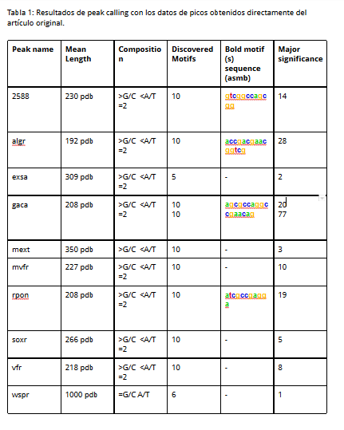


Tabla 2: Resultados de peak calling con los picos obtenidos con MACS2.
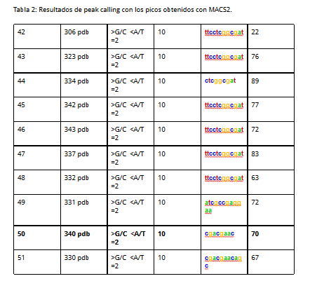


Despu?s las matrices con los resultados generados son guardadas en un formato .transfac

Uso de herramientas de clustering para corroborar los resultados:

Para realizar este paso, se cambia al servidor Fungi para aumentar la velocidad del proceso. Matrix tools -> Matrix-clustering, todos los par?metros se quedan en su forma predeterminada, con excepci?n de  Motif comparison with compare-matrices-quick (100 times faster). Only for Ncor and Cor, el cual se activa.  

Tabla 3: Resultados de matrix-clustering para ambos casos.


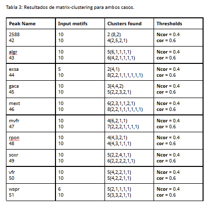

Control Negativo

Regresas al servidor RSat de Procariotes. Se usa NGS-ChIP-seq-> random genome fragments para buscar falsos positivos en los resultados. Para esto, se utiliza el mismo organismo que en el an?lisis de peak calling (Pseudomonas aeruginosa pao1.ASM676v1.30)  y dejas todas las opciones de forma predeterminada, con excepci?n de Mask repeats. Despu?s, se usa la opci?n Peak-motifs en RSat de Fungi; con los mismos par?metros que en el an?lisis de Peak calling.

Tabla 4: Resultados de control negativo para ambos casos.


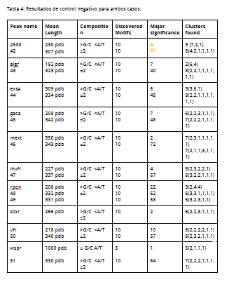

Como nota, todos los an?lisis de peak-motifs se realizaron con oligos, esto fue porque se intentaron usar otros enfoques (el an?lisis de diadas no fue usado en este punto) como el de tomar ?nicamente el par?metro de posici?n, el cual (generalmente) regres? menos motivos (con menor significancia) con las secuencias prueba. Y, en el control negativo disminuyeron a?n m?s los motivos encontrados (pero, la significancia se mantuvo). Por ejemplo, para el caso de la secuencia 2588 la secuencia regres? 4 motivos con significancia menor a 1 y el control negativo en este experimento retorn? 1 motivo con significancia de 1.  Adem?s, ?nicamente con este enfoque, podr?a usarse la secuencia completa del organismo como control.

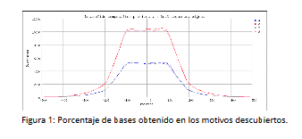

Motivos de algr
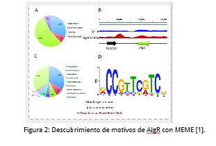


Figura 2: Descubrimiento de motivos de AlgR con MEME [1].
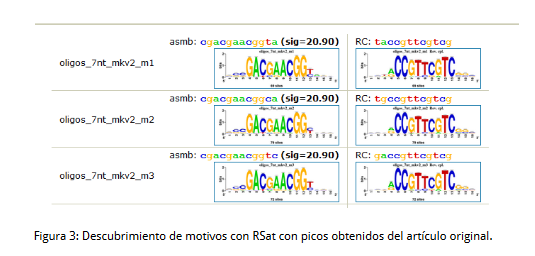

Figura 3: Descubrimiento de motivos con RSat con picos obtenidos del art?culo original.
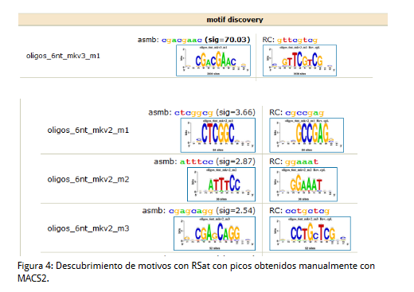

Figura 4: Descubrimiento de motivos con RSat con picos obtenidos manualmente con MACS2.

###An?lisis de diadas

El an?lisis de diadas se realiz? con la herramienta dyad-analysis de RSat, en el servidor de procariotes. Para esto, se us? el archivo en formato fasta del pico de AlgR y P. aeruginosa como organismo para modelo de Background, el resto de los par?metros se quedaron en su forma predeterminada.


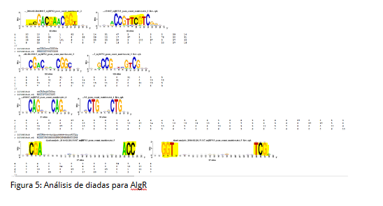
###Workflow para nuestros peaks

Descargar Secuencias de lecturas cortas
http://www.ebi.ac.uk/ena/data/view/SRP052880

Mapear con genoma de referencia en bowtie2
Index de genoma de Pseudomonas aeruginosa a bowtie2
http://support.illumina.com/sequencing/sequencing_software/igenome.html
bowtie2 build [Genome_fasta] PAO1

Mapear Lecturas de Illumina con genoma de referencia
	bowtie2 PAO1 seq_name.fastq -S seq_name.sam -N 1
	bowtie2 PAO1 seq_name.fastq -S seq_name.sam --very-sensitive

El cambio daba ~1% de m?s secuencias, por lo que decidimos usar en RSAT los mapeos de la l?nea inicial

Pseudomonas aeruginosa strain PAO1  NCBI  2000-09-13
 
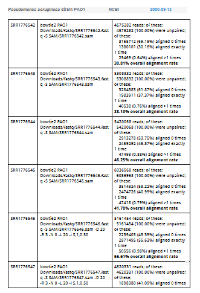
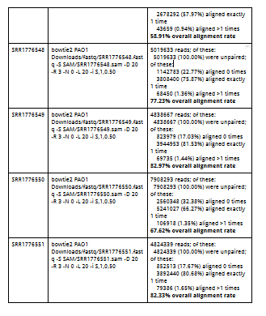


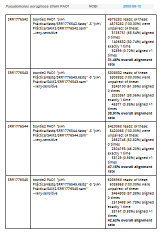
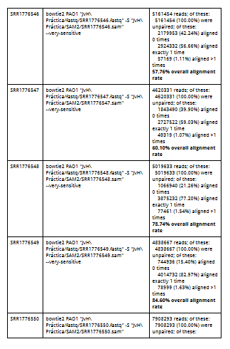
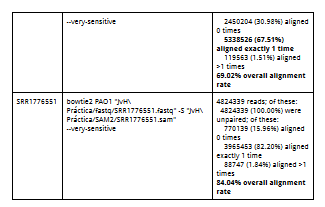


MACS2 Peak Call
macs2 callpeak -t SAM/$bname.sam -f SAM -n peaks/$bname -g 6.3e6 -q 0.01 --nomodel --shiftsize 100

------------------------
Comandos en el servidor: 

Peak Calling: $RSAT/perl-scripts/peak-motifs  -v 1 -title '2688vsmacs2'  -i $RSAT/public_html/tmp/apache/2016/02/20/peak-motifs.2016-02-20.195401_2016-02-20.195401_PP1XpT/peak-motifspeak_seq  -max_seq_len 1000 -markov auto -disco oligos,positions -nmotifs 5  -minol 6 -maxol 7  -no_merge_lengths -2str  -origin center  -motif_db regulonDB tf $RSAT/public_html/motif_databases/REGULONDB/regulonDB_2015-08-07.tf -scan_markov 1 -source getfasta  -task purge,seqlen,composition,disco,merge_motifs,split_motifs,motifs_vs_motifs,timelog,archive,synthesis,small_summary,motifs_vs_db,scan -prefix peak-motifs -noov -img_format png  -outdir $RSAT/public_html/tmp/apache/2016/02/20/peak-motifs.2016-02-20.195401_2016-02-20.195401_PP1XpT)

Matrix-clustering: $RSAT/perl-scripts/matrix-clustering  -v 1 -max_matrices 300 -matrix_format transfac -i $RSAT/public_html/tmp/www-data/2016/02/22/matrix-clustering_2016-02-22.014846_eMBEdG/matrix-clustering_query_matrices.transfac -hclust_method average -title 'testfun2588' -metric_build_tree 'Ncor' -lth w 5 -lth cor 0.6 -lth Ncor 0.4 -quick -label_in_tree name -return json,heatmap  -o $RSAT/public_html/tmp/www-data/2016/02/22/matrix-clustering_2016-02-22.014846_eMBEdG/matrix-clustering 2> $RSAT/public_html/tmp/www-data/2016/02/22/matrix-clustering_2016-02-22.014846_eMBEdG/matrix-clustering_err.txt

Control negativo: $RSAT/perl-scripts/random-genome-fragments  -template_format len -i $RSAT/public_html/tmp/apache/2016/02/21/random-genome-fragments_2016-02-21.202329_U9mlWz.lengths -org Pseudomonas_aeruginosa_pao1.ASM676v1.30  -return seq  -rm  -o $RSAT/public_html/tmp/apache/2016/02/21/random-genome-fragments_2016-02-21.202329_U9mlWz_fragments.fasta 2> $RSAT/public_html/tmp/apache/2016/02/21/random-genome-fragments_2016-02-21.202329_U9mlWz_error_log.txt

$RSAT/perl-scripts/peak-motifs  -v 1 -title '2588_negativectrol'  -i $RSAT/public_html/tmp/www-data/2016/02/22/peak-motifs.2016-02-22.032359_2016-02-22.032359_flPJWK/peak-motifspeak_seq -ctrl $RSAT/public_html/tmp/www-data/2016/02/22/peak-motifs.2016-02-22.032359_2016-02-22.032359_flPJWK/peak-motifscontrol_seq  -max_seq_len 1000 -markov auto -disco oligos,positions -nmotifs 5  -minol 6 -maxol 7  -no_merge_lengths -2str  -origin center  -motif_db regulonDB tf $RSAT/public_html/motif_databases/REGULONDB/regulonDB_2015-08-07.tf -scan_markov 1 -task purge,seqlen,composition,disco,merge_motifs,split_motifs,motifs_vs_motifs,timelog,archive,synthesis,small_summary,motifs_vs_db,scan -prefix peak-motifs -noov -img_format png  -outdir $RSAT/public_html/tmp/www-data/2016/02/22/peak-motifs.2016-02-22.032359_2016-02-22.032359_flPJWK


Bibliograf?a.
http://nar.oxfordjournals.org/content/43/17/8268.long
Langmead, B., Trapnell, C., Pop, M., & Salzberg, S. L. (2009). Ultrafast and memory-efficient alignment of short DNA sequences to the human genome. Genome biol, 10(3), R25.


$RSAT/perl-scripts/retrieve-seq  -org Pseudomonas_aeruginosa_PAO1_uid57945 -feattype gene -type upstream -format fasta -label name -from -1000 -to 200 -noorf  -rm  -all (?)

##Peak Calling Statistics

Llamamos datos
```{r}
chip_art <- read.table("GSE65356_algrmacs2e15_peaks.txt", header = T)
chip_ours <-read.table("SRR1776550_peaks.xls", header=T)

```
Ploteamos la distribuci?n de reads de acuerdo al pileup.

```{r}
par(mfrow=c(3,1))
hist(chip_art$pileup,
     main="Reads Distribution (Article)",
     ylab="Frequency",
     xlab="Pileup reads",
     xlim = c(0,300),
     col="red",
     border = "red",
     breaks = 500)

hist(chip_ours$pileup,
     main="Reads Distribution (Ours)",
     ylab="Frequency",
     xlab="Pileup reads",
     xlim = c(0,300),
     col="green",
     border = "green",
     breaks = 500)

hist(chip_ours$pileup,
     main="Reads Distribution (Ours) *Expanded",
     ylab="Frequency",
     xlab="Pileup reads",
     xlim = c(0,700),
     col="green",
     border = "green",
     breaks = 500)

```


Ploteamos el enriquecimiento de picos uno sobre otro y viceversa, para ver d?nde coinciden y con cu?nta precisi?n.
```{r}

par(mfrow=c(2,1))
plot(chip_art  $abs_summit,chip_art$fold_enrichment,
     main="Fold Enrichment (Article over ours)",
     ylab="Enrichment",
     xlab="Genome position",
     xlim = c(0,6400000),
     col="red",  type = "h")

par(new=T)

plot(chip_ours$abs_summit,
     chip_ours$fold_enrichment,
     xlim = c(0,6400000),
     ylab = "",
     xlab = "",
     col="green", type = "h")
     

plot(chip_ours $abs_summit,chip_ours$fold_enrichment,
     main="Fold Enrichment (Ours over)",
     ylab="Enrichment",
     xlab="Genome position",
     xlim = c(0,6400000),
     col="green",  type = "h")

par(new=T)

plot(chip_art$abs_summit,
     chip_art$fold_enrichment,
     xlim = c(0,6400000),
     ylab = "",
     xlab = "",
     col="red", type = "h")
``` 

summit <- chip_art$abs_summit
peaks <- apply(summit,1,subset(chip_ours,start<chip_art$abs_summit & end>chip_art$abs_summit)))
